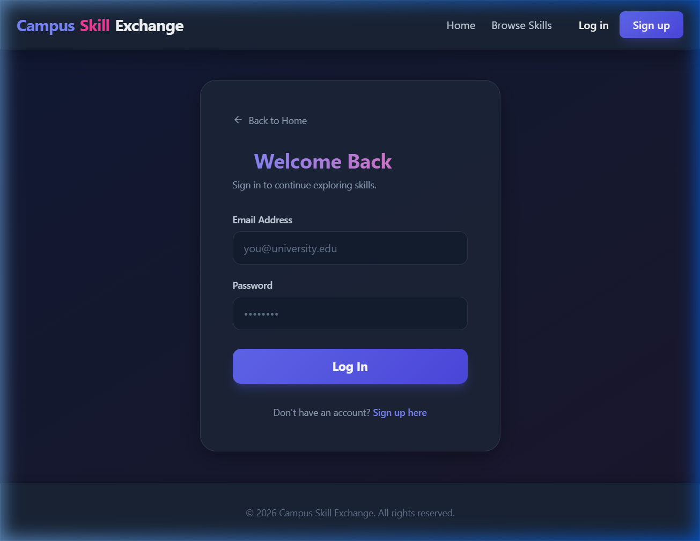
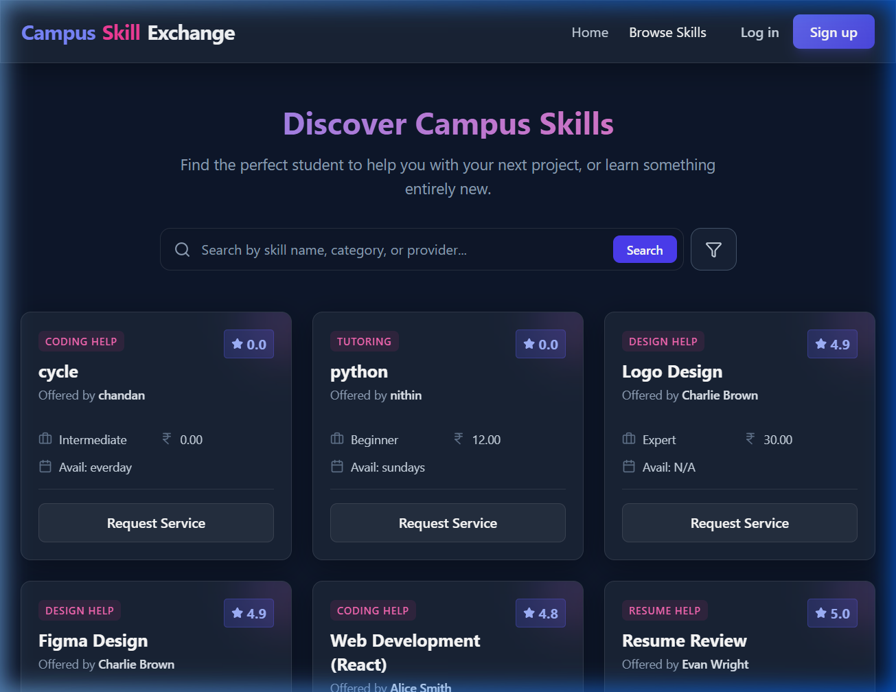
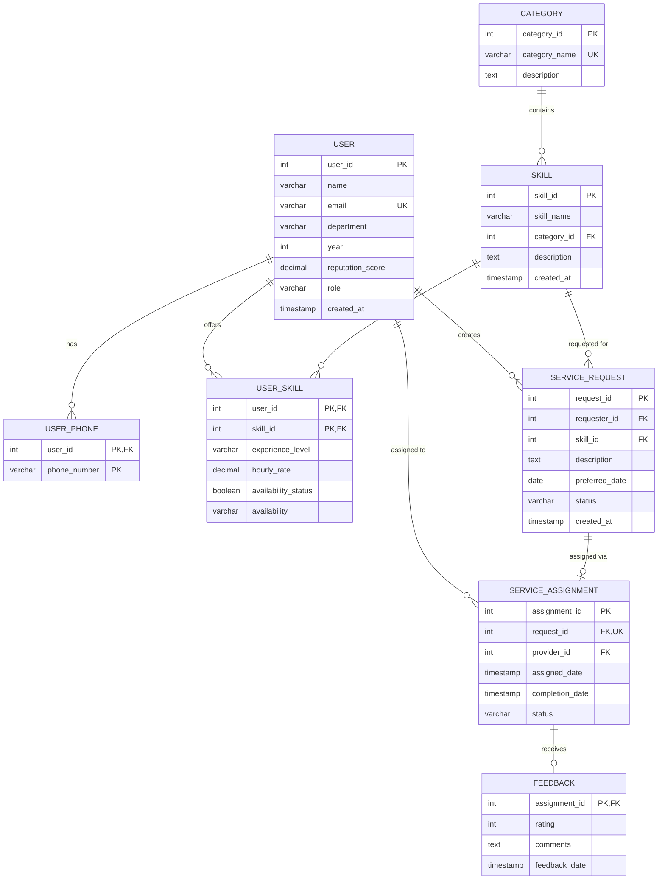

# 🎓 Campus Skill Exchange & Micro-Service Booking System

A full-stack peer-to-peer platform where university students can **offer**, **discover**, and **request** skills from fellow students — from coding help and tutoring to design work and resume reviews.

---

## ⚡ Quick Copy-Paste Commands

### **🔧 First-Time Setup**
Run these once to get your database and dependencies ready:
```bash
# Set up Database
psql -U postgres -d campus_skill_exchange -f schema.sql
psql -U postgres -d campus_skill_exchange -f seed.sql

# Install Everything
cd backend; npm install; cd ../frontend; npm install; cd ..
```

### **🚀 Daily Running**
Open **two terminals** and run these to start the project:

| **Terminal 1: Backend** | **Terminal 2: Frontend** |
|:---:|:---:|
| `cd backend; node server.js` | `cd frontend; npm run dev` |

---

## 🚀 Quick Start & Setup Guide

### 🛠️ Prerequisites & Downloads
To run this project, you need the following installed on your system:

| Tool | Purpose | Download Link |
|---|---|---|
| **Node.js (v18+)** | Backend/Frontend Runtime | [Download Node.js](https://nodejs.org/) |
| **PostgreSQL (v14+)** | Database System | [Download PostgreSQL](https://www.postgresql.org/download/) |
| **Git** | Version Control | [Download Git](https://git-scm.com/) |

### 🌍 Languages & Technologies
- **Frontend**: JavaScript (React 19, Vite 7), HTML5, CSS3 (TailwindCSS)
- **Backend**: JavaScript (Node.js, Express 5)
- **Database**: SQL (PostgreSQL)

---

### 📥 1. Clone the Repository
Open your terminal and run:
```bash
git clone https://github.com/looser-lag/DBMS-PROJECT.git
cd DBMS-PROJECT
```

### 🗄️ 2. Set Up the Database
1. Open your PostgreSQL terminal (`psql`):
   ```bash
   psql -U postgres
   ```
2. Run these commands inside the `psql` shell:
   ```sql
   CREATE DATABASE campus_skill_exchange;
   \c campus_skill_exchange
   -- (Optional) Exit psql and run:
   -- psql -U postgres -d campus_skill_exchange -f schema.sql
   -- psql -U postgres -d campus_skill_exchange -f seed.sql
   ```
3. Alternatively, use the included `schema.sql` and `seed.sql` files directly from your terminal:
   ```bash
   psql -U postgres -d campus_skill_exchange -f schema.sql
   psql -U postgres -d campus_skill_exchange -f seed.sql
   ```

### ⚙️ 3. Configure Environment
Go to the `backend/` folder and ensure there is a `.env` file with these values:
```env
DB_USER=postgres
DB_PASSWORD=your_password  # Update this with your actual DB password!
DB_HOST=localhost
DB_PORT=5432
DB_NAME=campus_skill_exchange
PORT=3000
```

### 🏃 4. Install & Run
You need to open **two** terminal windows:

#### **Terminal 1: Backend**
```bash
cd backend
npm install
node server.js
```

#### **Terminal 2: Frontend**
```bash
cd frontend
npm install
npm run dev
```

### 🔗 5. Access the Platform
- **Frontend**: [http://localhost:5173](http://localhost:5173)
- **Backend API**: [http://localhost:3000](http://localhost:3000)
- **Admin Panel**: [http://localhost:3000/admin](http://localhost:3000/admin)

---

## ✨ Features

- **Skill Marketplace** — Browse, search, and filter skills offered by students across categories
- **Service Requests** — Request help from specific providers with availability validation
- **User Roles** — Register as a Provider (offer skills) or Receiver (request services)
- **Dashboard** — Track your posted skills, incoming requests, and completed tasks
- **Feedback System** — Rate and review completed services (1–5 stars)
- **Admin Panel** — View all database tables and run raw SQL queries at `/admin`
- **Real-time Stats** — Platform-wide statistics (active students, skills available, tasks completed)

---

## 📸 Screenshots

### Home Page


### Login Page


### Browse Skills


---

## 🗄️ Database Design

### ER Diagram



### Normalization

All tables are in **3NF / BCNF**:

- **1NF**: All attributes are atomic; multi-valued phone numbers are separated into `USER_PHONE`
- **2NF**: No partial dependencies — all non-key attributes depend on the full primary key
- **3NF/BCNF**: No transitive dependencies — e.g., `SKILL.category_id` references `CATEGORY` rather than storing category info redundantly

### Key Relationships

| Relationship | Type | Description |
|---|---|---|
| USER ↔ USER_PHONE | 1:N | A user can have multiple phone numbers |
| USER ↔ USER_SKILL | M:N | Users offer multiple skills; skills offered by multiple users |
| CATEGORY ↔ SKILL | 1:N | Each skill belongs to one category |
| USER ↔ SERVICE_REQUEST | 1:N | A user can create many requests |
| SERVICE_REQUEST ↔ SERVICE_ASSIGNMENT | 1:1 | Each request has at most one assignment |
| SERVICE_ASSIGNMENT ↔ FEEDBACK | 1:1 | Each assignment receives at most one feedback |

---

## 🛠️ Tech Stack

| Layer | Technology |
|---|---|
| **Frontend** | React 19, Vite 7, TailwindCSS 4, Framer Motion |
| **Backend** | Node.js, Express 5 |
| **Database** | PostgreSQL |
| **Other** | Axios, React Router, Lucide Icons |

---


---

## 📁 Project Structure

```
campus_skill_exchange/
├── schema.sql              # DDL — Table definitions
├── seed.sql                # DML — Sample data
├── backend/
│   ├── .env                # Environment config
│   ├── db.js               # PostgreSQL connection pool
│   ├── server.js           # Express API server (all routes)
│   ├── admin_public/       # Admin dashboard static files
│   └── package.json
├── frontend/
│   ├── src/
│   │   ├── components/     # Reusable UI components
│   │   ├── pages/          # Route pages (Home, Dashboard, etc.)
│   │   ├── contexts/       # React context (Auth)
│   │   ├── services/       # API client (Axios)
│   │   └── main.jsx        # App entry point
│   └── package.json
└── screenshots/            # App screenshots for README
```

---

## 📊 Sample SQL Queries

> All queries are written for **PostgreSQL**. Note: `"USER"` must be double-quoted because `USER` is a reserved keyword in PostgreSQL.

---

### 1. Top 5 Providers by Reputation Score
```sql
SELECT name, department, reputation_score
FROM "USER"
WHERE reputation_score > 0
ORDER BY reputation_score DESC
LIMIT 5;
```

---

### 2. Most Requested Skills (with Category)
```sql
SELECT s.skill_name, c.category_name, COUNT(sr.request_id) AS total_requests
FROM service_request sr
JOIN skill s ON sr.skill_id = s.skill_id
JOIN category c ON s.category_id = c.category_id
GROUP BY s.skill_name, c.category_name
ORDER BY total_requests DESC;
```

---

### 3. Users Who Have Never Made a Service Request
```sql
SELECT u.name, u.email, u.department
FROM "USER" u
LEFT JOIN service_request sr ON u.user_id = sr.requester_id
WHERE sr.request_id IS NULL
ORDER BY u.name;
```

---

### 4. Average Rating per Provider
```sql
SELECT u.name, u.department,
       ROUND(AVG(f.rating)::NUMERIC, 2) AS avg_rating,
       COUNT(f.assignment_id) AS total_reviews
FROM feedback f
JOIN service_assignment sa ON f.assignment_id = sa.assignment_id
JOIN "USER" u ON sa.provider_id = u.user_id
GROUP BY u.user_id, u.name, u.department
ORDER BY avg_rating DESC;
```

---

### 5. All Pending Requests with Requester & Skill Details
```sql
SELECT sr.request_id,
       u.name AS requester_name,
       s.skill_name,
       c.category_name,
       sr.preferred_date,
       sr.description
FROM service_request sr
JOIN "USER" u ON sr.requester_id = u.user_id
JOIN skill s ON sr.skill_id = s.skill_id
JOIN category c ON s.category_id = c.category_id
WHERE sr.status = 'Pending'
ORDER BY sr.preferred_date ASC;
```

---

### 6. Providers Offering More Than One Skill
```sql
SELECT u.name, u.department, COUNT(us.skill_id) AS skills_offered
FROM "USER" u
JOIN user_skill us ON u.user_id = us.user_id
GROUP BY u.user_id, u.name, u.department
HAVING COUNT(us.skill_id) > 1
ORDER BY skills_offered DESC;
```

---

### 7. Skills That Have No Providers (Unmet Demand)
```sql
SELECT s.skill_name, c.category_name
FROM skill s
JOIN category c ON s.category_id = c.category_id
LEFT JOIN user_skill us ON s.skill_id = us.skill_id
WHERE us.user_id IS NULL
ORDER BY c.category_name, s.skill_name;
```

---

### 8. Users with Multiple Phone Numbers
```sql
SELECT u.name, u.email, COUNT(up.phone_number) AS phone_count,
       STRING_AGG(up.phone_number, ', ') AS phone_numbers
FROM "USER" u
JOIN user_phone up ON u.user_id = up.user_id
GROUP BY u.user_id, u.name, u.email
HAVING COUNT(up.phone_number) > 1
ORDER BY phone_count DESC;
```

---

### 9. Department-wise Service Request Count
```sql
SELECT u.department,
       COUNT(sr.request_id) AS total_requests,
       COUNT(CASE WHEN sr.status = 'Completed' THEN 1 END) AS completed,
       COUNT(CASE WHEN sr.status = 'Pending'   THEN 1 END) AS pending,
       COUNT(CASE WHEN sr.status = 'Assigned'  THEN 1 END) AS assigned
FROM "USER" u
LEFT JOIN service_request sr ON u.user_id = sr.requester_id
GROUP BY u.department
ORDER BY total_requests DESC;
```

---

### 10. Full Assignment Pipeline (Request → Assignment → Feedback)
```sql
SELECT sr.request_id,
       req.name     AS requester,
       prov.name    AS provider,
       s.skill_name,
       sr.status    AS request_status,
       sa.status    AS assignment_status,
       f.rating,
       f.comments
FROM service_request sr
JOIN "USER"            req  ON sr.requester_id   = req.user_id
JOIN service_assignment sa  ON sr.request_id     = sa.request_id
JOIN "USER"            prov ON sa.provider_id    = prov.user_id
JOIN skill             s    ON sr.skill_id        = s.skill_id
LEFT JOIN feedback     f    ON sa.assignment_id   = f.assignment_id
ORDER BY sr.request_id;
```

---

### 11. Provider Earnings Summary (Hourly Rate × Completed Assignments)
```sql
SELECT u.name,
       u.department,
       SUM(us.hourly_rate) AS estimated_earnings,
       COUNT(sa.assignment_id) AS completed_jobs
FROM "USER" u
JOIN service_assignment sa ON u.user_id = sa.provider_id
JOIN service_request sr ON sa.request_id = sr.request_id
JOIN user_skill us ON u.user_id = us.user_id AND sr.skill_id = us.skill_id
WHERE sa.status = 'Completed'
GROUP BY u.user_id, u.name, u.department
ORDER BY estimated_earnings DESC;
```

---

### 12. Skill Category Summary (Total Skills, Avg Rate, Total Providers)
```sql
SELECT c.category_name,
       COUNT(DISTINCT s.skill_id)   AS total_skills,
       COUNT(DISTINCT us.user_id)   AS total_providers,
       ROUND(AVG(us.hourly_rate)::NUMERIC, 2) AS avg_hourly_rate
FROM category c
JOIN skill s ON c.category_id = s.category_id
LEFT JOIN user_skill us ON s.skill_id = us.skill_id
GROUP BY c.category_id, c.category_name
ORDER BY total_providers DESC;
```

---

### 13. Using CTE — Top Provider per Category
```sql
WITH ranked_providers AS (
    SELECT
        c.category_name,
        u.name AS provider_name,
        ROUND(AVG(f.rating)::NUMERIC, 2) AS avg_rating,
        COUNT(f.assignment_id) AS total_reviews,
        RANK() OVER (
            PARTITION BY c.category_id
            ORDER BY AVG(f.rating) DESC
        ) AS rank
    FROM category c
    JOIN skill s ON c.category_id = s.category_id
    JOIN user_skill us ON s.skill_id = us.skill_id
    JOIN "USER" u ON us.user_id = u.user_id
    JOIN service_assignment sa ON u.user_id = sa.provider_id
    JOIN service_request sr ON sa.request_id = sr.request_id
                           AND sr.skill_id = s.skill_id
    JOIN feedback f ON sa.assignment_id = f.assignment_id
    GROUP BY c.category_id, c.category_name, u.user_id, u.name
)
SELECT category_name, provider_name, avg_rating, total_reviews
FROM ranked_providers
WHERE rank = 1
ORDER BY category_name;
```

---

### 14. Window Function — Rank Users by Reputation Within Department
```sql
SELECT name,
       department,
       reputation_score,
       RANK() OVER (
           PARTITION BY department
           ORDER BY reputation_score DESC
       ) AS dept_rank
FROM "USER"
WHERE reputation_score > 0
ORDER BY department, dept_rank;
```

---

### 15. Monthly Request Trend (Using DATE_TRUNC)
```sql
SELECT DATE_TRUNC('month', created_at) AS month,
       COUNT(*) AS total_requests,
       COUNT(CASE WHEN status = 'Completed' THEN 1 END) AS completed,
       COUNT(CASE WHEN status = 'Pending'   THEN 1 END) AS pending
FROM service_request
GROUP BY DATE_TRUNC('month', created_at)
ORDER BY month DESC;
```

---

### 16. Find Providers Available on Weekends with Expert Level
```sql
SELECT u.name, u.department, s.skill_name,
       us.hourly_rate, us.availability
FROM "USER" u
JOIN user_skill us ON u.user_id = us.user_id
JOIN skill s ON us.skill_id = s.skill_id
WHERE us.experience_level = 'Expert'
  AND us.availability_status = TRUE
  AND us.availability ILIKE '%weekend%'
ORDER BY us.hourly_rate ASC;
```

---

### 17. Subquery — Users Whose Reputation is Above Platform Average
```sql
SELECT name, department, year, reputation_score
FROM "USER"
WHERE reputation_score > (
    SELECT AVG(reputation_score)
    FROM "USER"
    WHERE reputation_score > 0
)
ORDER BY reputation_score DESC;
```

---

### 18. Platform-Wide Statistics (Single Summary Row)
```sql
SELECT
    (SELECT COUNT(*) FROM "USER")                                        AS total_users,
    (SELECT COUNT(*) FROM skill)                                         AS total_skills,
    (SELECT COUNT(*) FROM service_request)                               AS total_requests,
    (SELECT COUNT(*) FROM service_request WHERE status = 'Completed')    AS completed_requests,
    (SELECT COUNT(*) FROM service_request WHERE status = 'Pending')      AS pending_requests,
    (SELECT ROUND(AVG(rating)::NUMERIC, 2) FROM feedback)                AS overall_avg_rating,
    (SELECT COUNT(*) FROM feedback)                                      AS total_reviews;
```

---

## 📄 License

This project is for academic purposes as part of a DBMS course project.