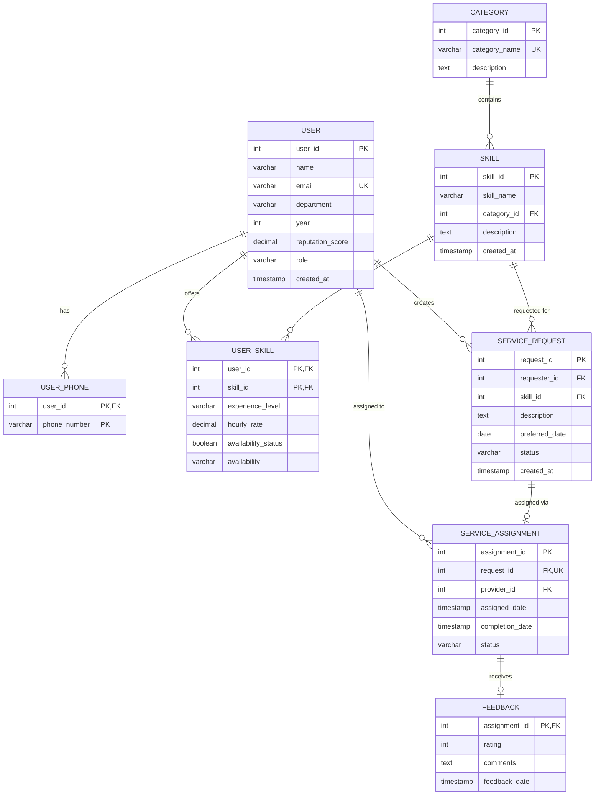

# 🎓 Campus Skill Exchange & Micro-Service Booking System

A full-stack peer-to-peer platform where university students can **offer**, **discover**, and **request** skills from fellow students — from coding help and tutoring to design work and resume reviews.

> Built as a **DBMS course project** demonstrating relational database design, normalization, and full-stack integration.

---

## ✨ Features

- **Skill Marketplace** — Browse, search, and filter skills offered by students across categories
- **Service Requests** — Request help from specific providers with availability validation
- **User Roles** — Register as a Provider (offer skills) or Receiver (request services)
- **Dashboard** — Track your posted skills, incoming requests, and completed tasks
- **Feedback System** — Rate and review completed services (1–5 stars)
- **Admin Panel** — View all database tables and run raw SQL queries at `/admin`
- **Real-time Stats** — Platform-wide statistics (active students, skills available, tasks completed)

---

## 📸 Screenshots

### Home Page


### Login Page


### Browse Skills


---

## 🗄️ Database Design

### ER Diagram



### Normalization

All tables are in **3NF / BCNF**:

- **1NF**: All attributes are atomic; multi-valued phone numbers are separated into `USER_PHONE`
- **2NF**: No partial dependencies — all non-key attributes depend on the full primary key
- **3NF/BCNF**: No transitive dependencies — e.g., `SKILL.category_id` references `CATEGORY` rather than storing category info redundantly

### Key Relationships

| Relationship | Type | Description |
|---|---|---|
| USER ↔ USER_PHONE | 1:N | A user can have multiple phone numbers |
| USER ↔ USER_SKILL | M:N | Users offer multiple skills; skills offered by multiple users |
| CATEGORY ↔ SKILL | 1:N | Each skill belongs to one category |
| USER ↔ SERVICE_REQUEST | 1:N | A user can create many requests |
| SERVICE_REQUEST ↔ SERVICE_ASSIGNMENT | 1:1 | Each request has at most one assignment |
| SERVICE_ASSIGNMENT ↔ FEEDBACK | 1:1 | Each assignment receives at most one feedback |

---

## 🛠️ Tech Stack

| Layer | Technology |
|---|---|
| **Frontend** | React 19, Vite 7, TailwindCSS 4, Framer Motion |
| **Backend** | Node.js, Express 5 |
| **Database** | PostgreSQL |
| **Other** | Axios, React Router, Lucide Icons |

---

## 🚀 Getting Started

### Prerequisites

- [Node.js](https://nodejs.org/) (v18+)
- [PostgreSQL](https://www.postgresql.org/) (v14+)

### 1. Clone the Repository

```bash
git clone https://github.com/looser-lag/DBMS-PROJECT.git
cd DBMS-PROJECT
```

### 2. Set Up the Database

```bash
# Connect to PostgreSQL and create the database
psql -U postgres
CREATE DATABASE campus_skill_exchange;
\q

# Run the schema and seed files
psql -U postgres -d campus_skill_exchange -f schema.sql
psql -U postgres -d campus_skill_exchange -f seed.sql
```

### 3. Configure Environment Variables

Create a `.env` file in the `backend/` directory:

```env
DB_USER=postgres
DB_PASSWORD=your_password
DB_HOST=localhost
DB_PORT=5432
DB_NAME=campus_skill_exchange
PORT=3000
```

### 4. Install Dependencies & Run

```bash
# Backend
cd backend
npm install
node server.js

# Frontend (in a new terminal)
cd frontend
npm install
npm run dev
```

### 5. Access the App

| Service | URL |
|---|---|
| Frontend | [http://localhost:5173](http://localhost:5173) |
| Backend API | [http://localhost:3000](http://localhost:3000) |
| Admin Dashboard | [http://localhost:3000/admin](http://localhost:3000/admin) |

---

## 📁 Project Structure

```
campus_skill_exchange/
├── schema.sql              # DDL — Table definitions
├── seed.sql                # DML — Sample data
├── backend/
│   ├── .env                # Environment config
│   ├── db.js               # PostgreSQL connection pool
│   ├── server.js           # Express API server (all routes)
│   ├── admin_public/       # Admin dashboard static files
│   └── package.json
├── frontend/
│   ├── src/
│   │   ├── components/     # Reusable UI components
│   │   ├── pages/          # Route pages (Home, Dashboard, etc.)
│   │   ├── contexts/       # React context (Auth)
│   │   ├── services/       # API client (Axios)
│   │   └── main.jsx        # App entry point
│   └── package.json
└── screenshots/            # App screenshots for README
```

---

## 📊 Sample SQL Queries

### Top 5 Providers by Reputation
```sql
SELECT name, department, reputation_score
FROM "USER"
WHERE reputation_score > 0
ORDER BY reputation_score DESC
LIMIT 5;
```

### Most Requested Skills
```sql
SELECT s.skill_name, c.category_name, COUNT(sr.request_id) AS total_requests
FROM SERVICE_REQUEST sr
JOIN SKILL s ON sr.skill_id = s.skill_id
JOIN CATEGORY c ON s.category_id = c.category_id
GROUP BY s.skill_name, c.category_name
ORDER BY total_requests DESC;
```

### Users Who Have Never Made a Request
```sql
SELECT u.name, u.email, u.department
FROM "USER" u
LEFT JOIN SERVICE_REQUEST sr ON u.user_id = sr.requester_id
WHERE sr.request_id IS NULL;
```

### Average Rating per Provider
```sql
SELECT u.name, AVG(f.rating) AS avg_rating, COUNT(f.assignment_id) AS total_reviews
FROM FEEDBACK f
JOIN SERVICE_ASSIGNMENT sa ON f.assignment_id = sa.assignment_id
JOIN "USER" u ON sa.provider_id = u.user_id
GROUP BY u.name
ORDER BY avg_rating DESC;
```

---

## 👥 Contributors

- **Looser Lag** — Full-stack development & database design

---

## 📄 License

This project is for academic purposes as part of a DBMS course project.